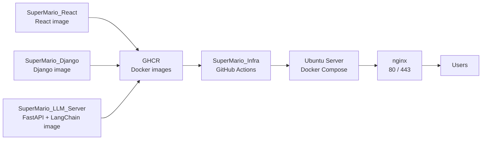

# SuperMario Infra

`SuperMario_Infra`는 SuperMario Flood Monitoring 서비스의 운영 배포를 담당하는 인프라 전용 레포입니다.

React, Django, LLM 서버는 각각의 서비스 레포에서 Docker image를 만들고 GHCR에 push합니다. 이 레포는 그 image들을 운영 서버에서 조합해 실행하고, nginx reverse proxy, HTTPS, PostgreSQL, Redis, Blue/Green 배포, 백업/복구 스크립트를 관리합니다.

## 한눈에 보기



## 운영 구성

| 영역 | 구성 |
| --- | --- |
| Frontend | React 정적 빌드 image, nginx 컨테이너 안에서 serving |
| Backend | Django + Channels + SWMM runtime |
| LLM Server | FastAPI + LangChain |
| Reverse Proxy | nginx |
| HTTPS | certbot + Let's Encrypt 자동 갱신 |
| Database | PostgreSQL Docker volume |
| Cache/Broker | Redis Docker volume |
| 배포 방식 | GitHub Actions + Docker Compose + Blue/Green |
| Image Registry | GHCR |

## 운영 서버 기준값

| 항목 | 값 |
| --- | --- |
| Domain | `supermario.o-r.kr` |
| External IP | `59.9.136.144` |
| Internal IP | `192.168.0.101` |
| SSH User | `seoktae` |
| SSH Port | `22` |
| Deploy Path | `/home/seoktae/Documents/TEAM_SUPERMARIO` |
| Public Ports | `80`, `443` |

DB, Redis, Django, LLM 서버는 Docker Compose 내부 네트워크에서만 통신합니다. 외부로 공개되는 포트는 기본적으로 `80`, `443`만 사용합니다.

## 레포 역할

| 레포 | 역할 |
| --- | --- |
| `SuperMario_React` | React 코드 관리, Docker image build, GHCR push |
| `SuperMario_Django` | Django 코드 관리, Docker image build, GHCR push |
| `SuperMario_LLM_Server` | FastAPI + LangChain 코드 관리, Docker image build, GHCR push |
| `SuperMario_Infra` | 운영 서버 배포, compose, nginx, HTTPS, DB volume, backup, rollback 관리 |

## 폴더 구조

```text
SuperMario_Infra/
├── .github/workflows/
│   ├── bootstrap-prod.yml
│   └── deploy-prod.yml
├── docs/
│   ├── deployment-flow.md
│   └── production-env.example.yml
├── nginx/conf.d/
│   ├── app.http.conf.template
│   └── app.https.conf.template
├── runtime/
│   └── .gitkeep
├── scripts/
│   ├── backup-db.sh
│   ├── deploy.sh
│   ├── healthcheck.sh
│   ├── init-letsencrypt.sh
│   ├── render-nginx.sh
│   ├── restore-db.sh
│   ├── rollback.sh
│   └── server-init.sh
├── docker-compose.prod.yml
├── .env.example
└── README.md
```

## 최초 배포 체크리스트

1. DNS 확인

   `supermario.o-r.kr`이 운영 서버의 외부 IP `59.9.136.144`를 바라봐야 합니다.

2. 공유기/방화벽 확인

   운영 서버로 `22`, `80`, `443` 포트가 연결되어 있어야 합니다.

3. Infra 레포 Secrets 등록

   `SuperMario_Infra` 레포의 `Settings > Secrets and variables > Actions`에 아래 값을 등록합니다.

   ```text
   SERVER_HOST
   SERVER_USER
   SERVER_PORT
   SSH_PRIVATE_KEY
   DEPLOY_PATH
   PRODUCTION_ENV_YAML_B64
   ```

4. 서비스 레포 Secrets 등록

   아래 세 서비스 레포에 같은 이름으로 등록합니다.

   ```text
   INFRA_DISPATCH_TOKEN
   ```

   등록 대상:

   ```text
   SuperMario_React
   SuperMario_Django
   SuperMario_LLM_Server
   ```

5. 운영 환경 YAML 준비

   `docs/production-env.example.yml`을 참고해 로컬에서 `production-env.yml`을 만들고, base64로 인코딩한 값을 `PRODUCTION_ENV_YAML_B64` Secret에 넣습니다.

   ```bash
   base64 -i production-env.yml | pbcopy
   ```

6. 최초 서버 부트스트랩 실행

   `SuperMario_Infra > Actions > Bootstrap Production`을 수동 실행합니다.

   첫 실행 권장값:

   ```text
   run_server_init: true
   issue_tls_certificate: true
   ```

7. 서비스 image 배포

   각 서비스 레포의 `prod` 브랜치에 push하면 image build/push 후 Infra 배포 workflow가 자동 호출됩니다.

## GitHub Actions 흐름

### 최초 1회 Bootstrap

```text
SuperMario_Infra Actions
  -> Bootstrap Production
  -> 서버에 Infra 파일 동기화
  -> PRODUCTION_ENV_YAML_B64 decode
  -> /home/seoktae/Documents/TEAM_SUPERMARIO/.env 업로드
  -> server-init.sh 실행
  -> Let's Encrypt 인증서 발급
  -> nginx + certbot 실행
```

### 일반 배포

```text
서비스 레포 prod push
  -> Docker image build
  -> GHCR image push
  -> SuperMario_Infra repository_dispatch 호출
  -> Deploy Production workflow 실행
  -> 서버 SSH 접속
  -> 새 image pull
  -> inactive color 컨테이너 실행
  -> health check 통과
  -> nginx upstream 전환
```

## Blue/Green 배포

서비스별 active color는 서버의 `runtime/active-colors.env`에 저장됩니다.

```text
FRONTEND_ACTIVE=blue
BACKEND_ACTIVE=blue
LLM_ACTIVE=blue
```

예를 들어 현재 backend가 `blue`이면 다음 backend 배포는 `green` 컨테이너에 새 image를 띄웁니다. health check가 성공하면 nginx upstream만 `green`으로 전환합니다.

이 구조에서는 frontend, backend, llm을 서로 독립적으로 배포할 수 있습니다.

## HTTPS

최초 인증서는 `Bootstrap Production` workflow에서 발급합니다.

인증서 발급 이후에는 `certbot` 컨테이너가 12시간마다 renew를 시도합니다. nginx는 ACME challenge 경로를 certbot과 공유하는 Docker volume으로 제공합니다.

수동으로 다시 발급해야 할 때는 서버에서 아래 명령을 실행할 수 있습니다.

```bash
cd /home/seoktae/Documents/TEAM_SUPERMARIO
scripts/init-letsencrypt.sh
```

## 운영 명령

운영 서버에서 직접 확인할 때는 deploy path로 이동합니다.

```bash
cd /home/seoktae/Documents/TEAM_SUPERMARIO
```

컨테이너 상태 확인:

```bash
docker compose -f docker-compose.prod.yml ps
```

로그 확인:

```bash
docker compose -f docker-compose.prod.yml logs -f nginx
docker compose -f docker-compose.prod.yml logs -f backend-blue
docker compose -f docker-compose.prod.yml logs -f backend-green
```

서비스 수동 배포:

```bash
scripts/deploy.sh backend ghcr.io/supermario-flood-monitoring/supermario-django <commit-sha>
scripts/deploy.sh frontend ghcr.io/supermario-flood-monitoring/supermario-react <commit-sha>
scripts/deploy.sh llm ghcr.io/supermario-flood-monitoring/supermario-llm <commit-sha>
```

롤백:

```bash
scripts/rollback.sh backend
scripts/rollback.sh frontend
scripts/rollback.sh llm
```

DB 백업:

```bash
scripts/backup-db.sh
```

DB 복구:

```bash
scripts/restore-db.sh backups/<backup-file>.sql.gz
```

## Volume 정책

| Volume | 용도 |
| --- | --- |
| `postgres_data` | PostgreSQL 데이터 |
| `redis_data` | Redis append-only 데이터 |
| `backend_data` | Django runtime 데이터 |
| `backend_static` | Django staticfiles |
| `backend_media` | Django media files |
| `certbot_www` | Let's Encrypt ACME challenge |
| `letsencrypt` | TLS 인증서 |

DB 포트는 외부에 열지 않습니다. 백업/복구는 서버 내부에서 compose network와 Docker volume을 기준으로 수행합니다.

## 서버 이전 절차

나중에 AWS EC2 같은 VM으로 이전할 때는 아래 순서로 진행합니다.

1. 새 VM에 Docker와 GitHub Actions SSH 접속용 public key를 준비합니다.
2. DNS 또는 `SERVER_HOST` Secret을 새 서버 주소로 변경합니다.
3. `DEPLOY_PATH`가 바뀌면 Infra Secret도 함께 수정합니다.
4. 기존 서버에서 DB 백업을 생성합니다.
5. 새 서버에서 `Bootstrap Production` workflow를 실행합니다.
6. 새 서버에 DB 백업 파일을 옮긴 뒤 `restore-db.sh`로 복구합니다.
7. 서비스 레포의 `prod` 브랜치 배포를 한 번씩 실행해 최신 image를 올립니다.
8. 도메인 접속, `/api/`, `/llm/`, Django admin, WebSocket 경로를 확인합니다.

## 보안 규칙

- 실제 `.env` 파일은 Git에 올리지 않습니다.
- `production-env.yml`은 로컬 작업용 파일이며 Git에 올리지 않습니다.
- `docs/production-env.example.yml`에는 예시값만 둡니다.
- Base64는 보안 수단이 아닙니다. 실제 보호는 GitHub Secrets와 레포 접근 권한이 담당합니다.
- Infra 레포는 private으로 유지하는 것을 권장합니다.
- 서비스 image가 public GHCR package라면 image 안에 secret이 들어가지 않도록 주의합니다.

## 참고 문서

- [배포 흐름](docs/deployment-flow.md)
- [운영 환경 YAML 예시](docs/production-env.example.yml)
